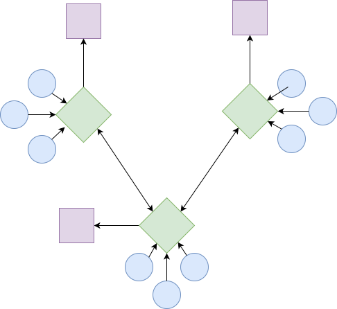
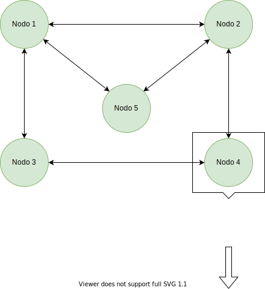
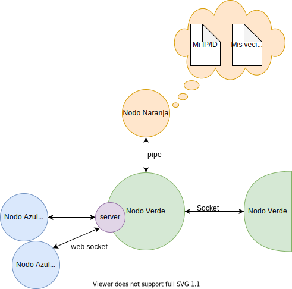
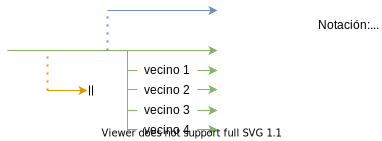

# Empanada Networking
Repositorio para la solución al proyecto integrador de redes y sistemas operativos.

## Integrantes  

	Sebastián Alfaro León 	B60210
	Jostyn Delgado Segura 	B82568
	Alejandro Duarte Lobo 	B62386
	Daniel Henao Gómez 	B83714

## Descripción General
Se desea programar un sistema de nodos interconectados, con una topología  definida por el grupo o profesores, de manera que puedan enviar y desplegar mensajes recibidos entre ellos. Cada nodo representa una computadora o terminal distinta y cada nodo tiene componentes o "sub-nodos" con diferentes funcionalidades, representados con colores.

## Fase I
1. **Nodo Verde:**
El nodo verde es el nodo principal del esquema. Este nodo simula una maquina y su función es realizar una intercomunicación entre nodos.
Este nodo verde podrá establecer una conexión arbitraria con uno o más nodos verdes. Los nodos verdes que se encuentran conectados a este nodo reciben el nombre de "vecinos".
Este nodo es el encargado de instanciar el nodo naranja y posteriormente entablar una comunicación con el mismo.
Los nodos verdes integraran dentro de sus componentes un servidor web.
Un nodo verde podrá estar conectado mediante el servidor web a uno o más nodos azules

2. **Nodo Naranja:**    
Se debe programar un nodo naranja, el cual lee y almacena la información de 2 archivos, estos archivos contienen datos sobre la topología de los nodos, es decir,  un archivo contiene información sobre los vecinos del nodo verde sus IPs, puertos e IDs, y otro archivo contiene la información "personal" del nodo verde, su IP, puerto e ID.  
Este nodo es instanciado por el nodo verde (usando fork y luego exec), y se conecta a este mediante un pipe, por el cual transmitirá la información que contienen sus archivos a dicho nodo verde.  

3. **Nodo Azul:**
Se debe programar además un *nodo azul* que representa la interfaz con el usuario, en este caso un servidor web el cual transmite información a los clientes web por HTTP o un web socket.
Cada nodo azul es creado por su nodo verde al igual que el nodo naranja, sin embargo a diferencia del naranja este nodo no se destruye cuando finaliza su trabajo pues debe quedarse a la espera de solicitudes siempre.
Cada mensaje sale inicialmente de un nodo azul y es transmitido a su nodo verde respectivo , el cual envía este mensaje a su vecino que a la vez lo transmite a su nodo azul destino.

### Línea de Tiempo  

* El nodo verde "nace" sin conocer a ningún vecino , sin poder comunicarse con ninguno de ellos, y tampoco conoce su información propia.
* Primero necesita saber cuál es su lugar en la red; es decir, saber cuál es su *ID,ip y puerto* y cuáles son sus vecinos. Para ello hace un *fork*  o instancia un nodo naranja. Se establece un *pipe* conectar el nodo verde con el nodo naranja.
* El nodo naranja lee dos archivos, uno de ellos contiene el *ID,ip y puerto* del nodo verde y el otro la misma información de sus vecinos. El nodo naranja deberá comunicarle esta información al nodo verde.
* El nodo verde responde que ya recibió satisfactoriamente la información y en ese momento acaba el proceso del nodo naranja.
* Cuando el nodo verde ya cuenta con la información necesaria, puede establecer un servidor de comunicación con los nodos azules.
* Luego va a establecer un servidor de comunicación por cada uno de sus vecinos, se establece el puerto asignado, en el cual sus vecinos sepan a dónde pueden enviarle mensajes. La comunicación con los vecinos se realiza mediante el protocolo **UDP**. Para comunicarse entre nodos verdes es necesario que cada uno de ellos conozca el IP del nodo vecino y el puerto al que pueden enviar información, esta informacion es la obtenida del nodo naranja.
* El usuario puede ahora enviar mensajes a través de los nodos verdes mediante la interfaz web, la cual corresponde al nodo azul, que puede ser accesada desde un navegador común. La interfaz se conecta al servidor, incorporado en el nodo verde ("nodo morado"), utilizando el protocolo **HTTP**.
* De esta forma el usuario puede conectarse desde su máquina y enviar mensajes simples a través de los nodos, que puden ser recibidos y desplegados en otra máquina por otro usuario.  

nota: En esta fase solo se pueden enviar mensajes a los vecinos de cada nodo. Si 2 nodos no son vecinos directos no se pueden comunicar.  

## Preguntas
- ¿Se debe usar algún protocolo para enviar información por el web socket?
- ¿Cómo se comunica el web server con el nodo verde?
- ¿Se puede usar std::threads para manejar pthreads o se debe usar la libreria `<pthreads.h>` obligatoriamente?
