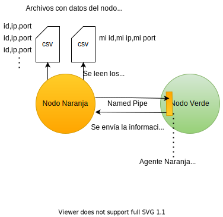
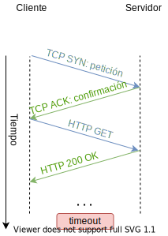
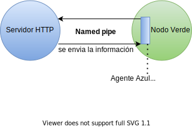
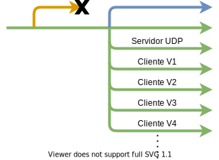
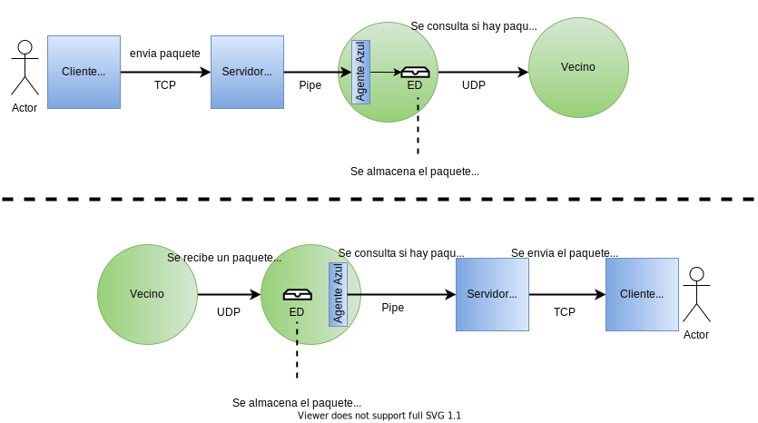

# Diseño detallado para la Fase I
### CI-0123
```
Equipo: Empanada Networking

-Alejandro Duarte      B62386        
-Daniel Henao          B83714
-Sebastian Alfaro      B60210
-Jostyn Delgado        B82568
```


1. Documentar en detalle las acciones esperadas para cada componente (no se preocupen por detalles específicos de implementación):

## Proceso Naranja:
* **Lenguaje**: Python3

* **Componentes Adicionales**: Se utilizan 2 archivos de formato `csv` (MisVecinos.csv y MisDatos.csv).

* **Funcionalidad**: Se encarga, en primera instancia, de leer y procesar los datos de los archivos MisVecinos.csv y MisDatos.csv.

* **implementación**: Para la lectura y procesamiento de los dos archivos de datos, `MisVecinos.csv` contiene varias líneas con datos separados por comas, estos datos incluyen, un numero identificador, una dirección ip y un puerto. Cada una de estas líneas con los datos mencionados corresponde a un vecino directo del nodo verde. Por otra parte, en `MisDatos.csv` se almacena una sola linea con los mismos datos que el archivo de vecinos, que en este caso corresponden a los datos de el nodoVerde, cada uno de estos archivos se escribe a mano siguiendo una topología prediseñada. El programa se encargará de leer cada uno de estos archivos, eliminar cualquier tipo de caracteres no deseados en las líneas leídas, y almacenar estos datos en variables locales para ser enviados.
Posteriormente se creará un "named pipe" o "FIFO", que consiste en un archivo temporal por el cuál se le envirán los datos anteriormente mencionados. Para que tanto el nodo verde sepa que esta recibiendo, y el nodo naranja sepa que enviarle al nodo verde se optará por el uso de señales enviadas mediante el pipe, las cuales consisten numeros o caracteres, se han definido hasta el momento, una señal para terminar, otra para enviar los datos del nodo verde y otra para los datos de sus vecino. En el caso de los datos de vecinos, al tener que enviar varias lineas se hará uso de una espera activa o "busywaiting", que esperará hasta que una de las señales anteriormente mencionadas sea recibida para indicar que se terminaron de leer los datos desde el lado del nodo verde y seguir enviando sus datos, de esta manera se evitan problemas de sincronización.  


## Agente Naranja en Verde:
* **Lenguaje**: C++

* **Funcionalidad**: Se encarga de instanciar el programa NodoNaranja.py y recibir y almacenar datos sobre su IP y su puerto, y datos sobre el IP y puerto de sus vecinos que posteriormente se utilizarán para realizar distintas conexiones.

* **implementación**: Se programará un método, el cuál sera el primer método en correr en todo el programa, que se encargara, primeramente, de ejecutar una llamada a `fork()`, el cual creará una división en un proceso padre y un poceso hijo.  
a) Proceso hijo: Este proceso se encargará de ejecutar un `exec()` para correr el script de python correspondiente al nodo naranja. Luego de realizar esta acción se desligará completamente del programa principal.  
b) Proceso padre: Este proceso es el encargado de enviarle las primeras señales al nodo naranja para empezar a recibir sus datos, estas señales y estos datos se envian respectivamente por el "named pipe" creado por el nodo naranja. Una vez termina de recibir todos sus datos, le envía al nodo naranja una última señal para que este proceso finalice. Durante el proceso de recibir la información del nodo naranja, este se encargará de dividirla, y almacenarla en una estructura de datos utlilizando pares ordenados `std::pair`.


## Capa de aplicación:
**Servidor HTTP Azul:**
* Lenguaje: Python3 u otro lenguaje.
* Funcionalidad: Su primer función es establecer un puerto donde recibirá conexiones de clientes, posteriormente se encarga de recibir solicitudes HTTP de uno o varios clientes HTTP. Se comunica con los clientes usando el protocolo de transporte TCP y responde a las solicitudes HTTP enviando los recursos solicitados. Se comunica con el agente azul para poder interactuar con la red y así recibir y enviar paquetes a otros hosts.

* Implementación: Este servidor es implementado como un proceso invocado por el nodo verde, reserva un puerto conocido en el cual escuchará las conexiones entrantes mediante un web socket y redirigirá los mensajes al agente azul por medio de un named pipe.  


**Cliente HTTP Azul (con un solo un cliente):**

* Lenguaje: ASP.NET, HTML y CSS ?

* Funcionalidad: Se encarga de establecer una comunicación con el servidor HTTP mediante una conexión TCP. Además presenta una interfaz con el usuario en donde puede visualizar los mensajes recibidos de otros clientes y enviar así mismo mensajes a otros clientes. Esta interfaz se puede acceder desde un navegador facilitando su uso.

* Implementación: Este cliente es implementado como un sitio web usando HTML y CSS para desplegar información sobre los hosts con los que se puede comunicar, posee ademas una pagina en la que puede ver si ha recibido mensajes y una pagina para enviar mensajes a los hosts disponibles.

**Agente Azul en Verde:**
* Lenguaje: C++

* Funcionalidad: Se encarga inicialmente de levantar el nodo azul y posteriormente de recibir y enviar mensajes al servidor HTTP asociado al nodo verde. Estos mensajes los almacena para su envío y  obtiene para su recepción de estructuras de datos en el nodo verde.

* Implementación: Este agente es implementado con un hilo dedicado a la comunicación con el servidor HTTP, usa el protocolo TCP para comunicarse con el proceso del servidor y está constantemente revisando la estructura de datos donde llegan los mensajes dirigidos al servidor HTTP. Si esta estructura de datos no esta vacía, se extraen los elementos y son enviados al servidor HTTP por medio de un named pipe que debió ser creado anteriormente por este servidor. Por otro lado, los mensajes que son recibidos por el servidor HTTP son capturados y almacenados en una estructura de datos, donde otro agente los enviará al destino correspondiente.

## Capa de enlace de datos:

**Envío de datos a cada vecino verde:**

* Lenguaje: c++

* Funcionalidad: Tomar los paquetes recibidos por el nodo azul y mediante un socket UDP, enviar el paquete al vecino que corresponde.

* Implementación: Dado que en el sistema va a existir una estructura de datos donde se encuentra la información de los vecinos, el nodo verde sabrá cuantos vecinos existen, y de esta forma creara un hilo por cada vecino. Estos hilos se conectaran vía UDP hacia el servidor del vecino que le corresponde.  Cada hilo llamará una función: ```conexiónVecino(int id)``` que le permite asociarse al servidor de un vecino. Esto se logra utilizando otro método dentro de esta misma función que puede llamarse `recuperarDatosVecino(int id)` que devolvera el IP y puerto del vecino solicitado.

  En la estructura que guardará los mensajes de los clientes, los hilos accedan al paquete y se preguntan ¿este mensaje corresponde con mi id? Si la respuesta es si entonces toma el mensaje y lo envía, de lo contrario no hace nada.  
  Para sincronizar el acceso de cada hilo a las estructuras de datos se utilizaran `<mutex>`.

**Recepción de datos de vecinos verdes:**

* Lenguaje: c++
* Funcionalidad: Tener un socket servidor escuchando mensajes provenientes de los nodos verdes vecinos y almacenarlos.
* Implementación: El nodo verde hará un hilo exclusivo para que abra una un servidor UDP con el puerto que  se le pidió previamente al nodo naranja con 'mis datos' y de esta forma recibir los paquetes de los demás nodos verdes. En este punto debemos administrar una estructura de datos de mensajes recibidos y almacenar estos mensajes entrantes en esta. Posteriormente se debe avisar al agente azul que esta estructura de datos no está vacía, es decir, que hay mensajes pendientes por recibir.

## Interacción entre componentes a nivel del nodo Verde:

* Funcionalidad:
  * **Agente naranja:** Inicialmente se requiere arrancar un agente naranja para que se comunique con el nodo naranja, acción que se produce ejecutando un hilo dentro del proceso principal.
  * **Almacenamiento:** Se requiere una estructura de datos donde el agente naranja pueda almacenar los *ID* de los vecinos y el *ID* propio, tentativamente una estructura con función similar a la de una tabla hash, donde las llaves identifican los nodos verdes y los datos que contienen son las direcciones IP y puertos de los vecinos.
  * **Agente azul:** El proceso principal se encarga se arrancar el agente azul, este corresponde a un hilo, se encarga de comunicarse con el servidor web. Además, este requiere de algún mecanismo de comunicación con los agentes verdes, como lo son estructuras de datos que puedan leer y escribir entre ambos.
  * **Agentes verdes:** Dentro del proceso principal se instancian o crean los hilos  requeridos para la comunicación con los vecinos. Para ello se consulta la estructura de datos que contiene información de los vecinos, lo cual requiere un método de consulta.  
  * **Comunicación desde agentes azules hacia agentes verdes:** Se requiere de alguna estructura de datos que almacene temporalmente mensajes provenientes del nodo azul, que el agente azul le transmite a los agentes verdes, para ser posteriormente enviados a su vecinos. En este caso se plantea definir una estructura de mensajes de salida, sea una pila o bien una cola, donde el agente azul dispone de alǵun método para insertar los mensajes salientes. Por otro lado cada agente verde podrá revisar la estructura de mensajes de salida y verificar si le corresponde o no tomar el mensaje y enviarlo, para ello se plantea algún método.
  * **Comunicación desde vecinos hacia cliente azul:** Se requiere de alguna estructura de datos que almacene temporalmente mensajes provenientes de los vecinos, que los agentes verdes le transmiten al agente azul, para ser posteriormente enviados al nodo azul. En este caso se plantea definir una estructura de mensajes entrantes, sea una pila o bien una cola, donde los agentes verdes disponen de un método para insertar los mensajes de entrada, y el agente azul dispone de otro método para leer los paquetes de la misma estructura de datos.

---
2. Muestre con gráficos explicados, el flujo de datos y acciones completo desde la solicitud de usuario de envío de mensaje hasta la recepción del mensaje en el usuario destino.
#### Inicio del programa, Nodo naranja y Nodo Azul:

a- Primero, el nodo naranja es instanciado por el agente naranja (thread) que se encuentra en el nodo verde usando un `fork()` y luego un `exec()` de parte del proceso hijo.  

  

b- El proceso padre procede a esperar a recibir datos como se muestra en el siguiente diagrama:

  

c- El proceso que ejecutó el nodo naranja termina, y el programa procede a instanciar el servidor HTTP Azul desde el agente Azul en verde (thread) , ya teniendo la información necesaria:  

  
#### Conexion y solicitud del usuario, cliente HTTP Azul:
Se debe establecer siempre una conexión TCP que consta de 2 pasos para poder correr el protocolo HTTP. Posteriormente, el usuario podrá enviar mensajes por medio de un navegador al servidor web.

  

#### Envio de mensajes de nodo Azul a Nodo verde(Agente Azul):
La recepción de mensajes del servidor HTTP (nodo azul), en agente azul en el nodo verde se realiza mediante un pipe de la misma manera que en el proceso del nodo naranja:



#### Manejo de paquetes recibidos en el nodo verde.

a- Se crearán hilos correspondientes a la cantidad de vecinos que tenga el nodo Verde para realizar conexiones UDP y enviar mensajes. A su vez, se creará un hilo servidor UDP para recibir mensajes de otros vecinos:

  

b- Si se recibe un mensaje del nodo azul al nodo verde(parte superior del gráfico), se implica que es un mensaje que el usuario quiere enviar a uno de los vecinos del nodo verde, por lo cual, se escribio desde el cliente HTTP, que luego mediante su conexion TCP se envia al servidor HTTP, que posteriormente se envia al agente azul en el nodo verde mediante un pipe, donde sera almacenado en una estructura de datos. Al almacenarse en esta estructura de datos, se enviara una señal a los hilos conectados a los vecinos que enviaran el paquuete al vecino correspondiente por medio de su conexión UDP.

c-Si se recibe un mensaje de un vecino al nodo verde(parte inferior del gráfico), este debe ser transportado hasta el cliente HTTP, por lo cual, al recibirse mediante la conexión UDP se almacena en una estructura de datos y se envia una señal al azul, con la cual este sabra que tiene que extraer el mensaje de la estructura de datos y enviarsela al servidor HTTP mediante el pipe, el cual posteriormente le enviara, por medio de su conexion TCP, el paquete al cliente, donde será desplecado al usuario.  

El recorrido de mensajes descrito en los dos puntos anteriormente mencionados se pueden apreciar en el siguiente gráfico:

  

---
